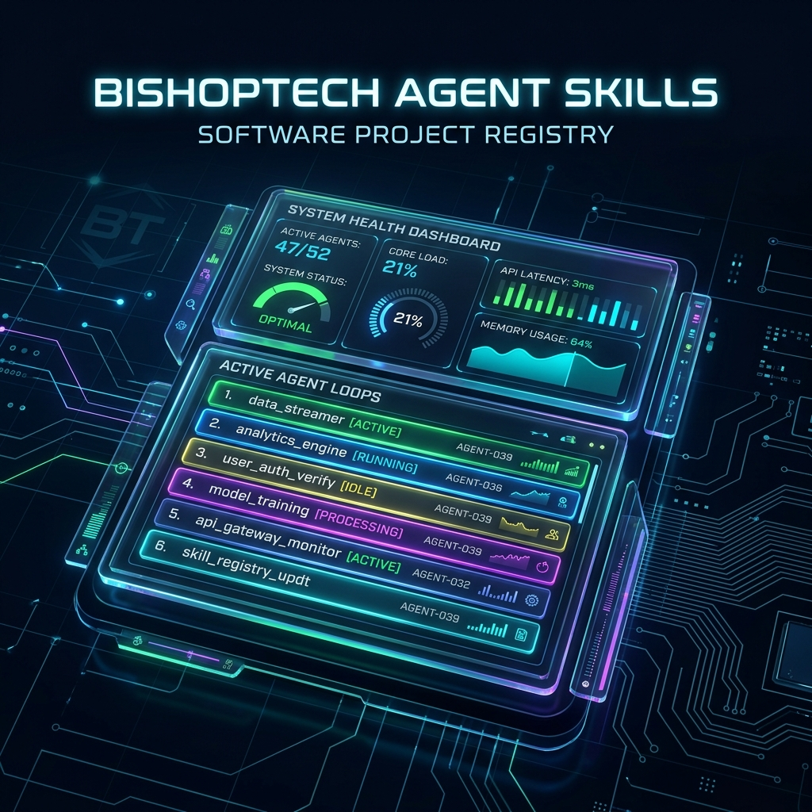

# 🦾 BishopTech Agent Skills: Software Project Registry



Welcome to the **BishopTech Agent Loop Skills** monorepo registry. This catalog hosts seven production-grade, enterprise-ready, installable agent skills designed for **Hermes, Codex, Antigravity, and Claude Code**.

By moving from manual prompting to structured **Loop Engineering**, these skills replace manual verification workflows with automated, self-correcting feedback loops.

---

## ⚡ Unified Loop Registry

This monorepo indexes the following seven skills. Each directory is a standalone Git repository containing its own `SKILL.md` (for agent discovery) and a detailed `README.md` (for human configuration).

| Skill Directory | Core Purpose | Primary Feedback Signal | Stop Condition / Success |
| :--- | :--- | :--- | :--- |
| [📂 `coding-loop`](./coding-loop/) | Autonomous software developer loop | Compiler exit codes & unit test logs | All tests pass & static checkers approve |
| [📂 `marketing-eval-loop`](./marketing-eval-loop/) | Taste-gated content/copy verification | LLM-as-a-Judge criteria rubric | Weighted average score $\ge 0.70$ & human approval |
| [📂 `runtime-guardrail-loop`](./runtime-guardrail-loop/) | Pre-ship regression & production watchdog | Test suite delta tracking | Baseline comparison matches or improves |
| [📂 `vapi-outbound-loop`](./vapi-outbound-loop/) | Outbound lead calling manager | Call status API polling | Dialing queue complete & transcripts evaluated |
| [📂 `vapi-inbound-trainer-loop`](./vapi-inbound-trainer-loop/) | Inbound buyer objection roleplay simulator | Trainee transcript compliance checks | Assistant system prompt auto-tuned to block exploits |
| [📂 `agentic-vercel`](./agentic-vercel/) | Senses Bundle (Vision, Talk, Hearing, Logic) | Multimodal UI screenshots, audio linting | All sense validation gates green |
| [📂 `vercel-deploy-nurture`](./vercel-deploy-nurture/) | Vercel CLI deploy & local disk optimizer | Vercel remote build status & HTTP health checks | Verified live endpoints & `node_modules` deleted |

---

## 🚀 Installation & Git Publishing

To make these skills available for your agents or public distribution:

### 1. Locally Linking a Skill
To register an individual skill from this registry with your local agent CLI:
```bash
# Example: Installing the Vercel Deploy & Nurture skill
agents skill install file:///Users/matthewbishop/BishopTech.dev/bishoptech-skills-for-agents/vercel-deploy-nurture
```

### 2. Publishing Individual Sub-Repositories
To publish changes to all individual skill repositories at once, run:
```bash
chmod +x publish_repos.sh
./publish_repos.sh
```
*This script automatically updates the git authorship metadata to `mbishopfx` (`mattbishopfx@gmail.com`), commits changes, creates repositories on GitHub, pushes to `main`, and invites `matt@bishoptech.dev` (GitHub: `bishoptechllc`) as a collaborator.*

### 3. Toggling Monorepo vs. Sub-Repo Mode
We have provided a utility script [`git_restore.sh`](./git_restore.sh) to help manage file tracking:
```bash
# Switch to Monorepo Mode (for unified commits and parent repository tracking)
./git_restore.sh monorepo

# Switch to Sub-Repo Mode (to restore individual .git repositories)
./git_restore.sh subrepos
```

---

## 🧠 Senses & Loop Architecture

Traditional prompt engineering focuses on the **input** (instructions, contexts). Loop Engineering focuses on the **output** (validation gates, test suites, and correction iterations).

```
[Trigger / Schedule] ──► [Discover Context] ──► [isolated Execution (Worktree)]
                                                        │
                                                        ▼
[ PR / Deploy / Ship ] ◄── [Adversarial Check] ◄── [Verify (Tests / LLM Judge)]
```

### Key Loop Patterns Implemented in this Catalog:
- **Maker-Checker Split**: The agent that implements code changes or drafts content is never the one that verifies it. An independent checker (using scripts like `verify_code.py` or `judge_content.py`) evaluates the results with zero bias.
- **Closed-Loop Feedback**: Production failures or user rejections are captured and written back directly into the local JSON test suites (`test_suite.json`), guaranteeing that bugs are never reintroduced in subsequent deploys.
- **Multi-Model Cost Routing**: Models are routed dynamically via the Vercel AI Gateway. Cheaper models handle the first pass; if verification fails, the query fallbacks to high-capacity reasoning engines, and finally escalates to a human review gate.
- **Visual & Audio Linter Gates**: The `agentic-vercel` senses bundle introduces visual layout audits (multimodal screenshot comparison) and speech generation analysis (scanning TTS output files for clipping and silence).
