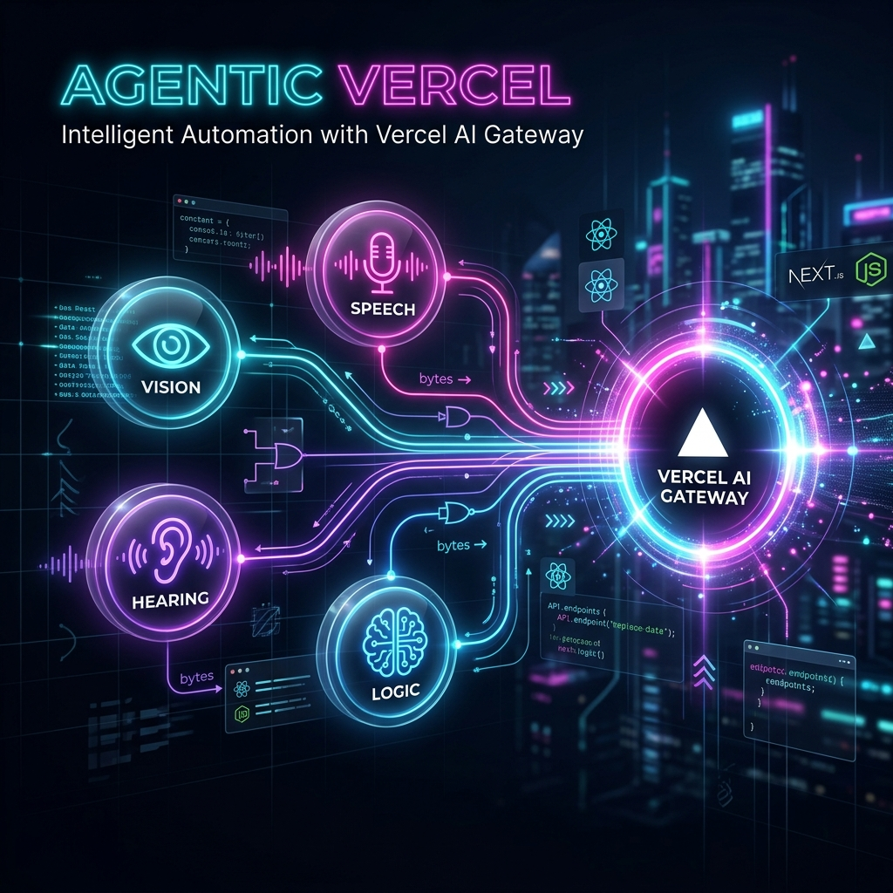

# 🧠 Agentic Vercel: Senses Skills Bundle



> **"Give your AI agents Vision, Talk, Hearing, and Thinking—powered and routed through the Vercel AI Gateway."**

Building complex multi-modal agent workflows is difficult: models are non-deterministic, audio synthesis can contain glitches, transcribers fail on accents, and frontier reasoning models are too expensive to query for simple tasks.

`agentic-vercel` is a unified bundle of four agentic loop skills that integrate with the **Vercel AI Gateway**. It provides routing, fallbacks, caching, and evaluation gates that enable your agents to see, speak, hear, and reason with enterprise-level stability.

---

## ⚡ The Four Senses Loops

This bundle contains the following installable loop skills:

| Sense | Loop Skill Folder | Core Purpose | Gateway Features Used |
| :--- | :--- | :--- | :--- |
| 👀 **Vision** | [`/vision-loop`](./vision-loop/) | Multimodal layout & design verification | Caching, Multi-Provider fallback |
| 🗣️ **Talk** | [`/talk-loop`](./talk-loop/) | TTS validation & quality correction | Failover, latency logging |
| 👂 **Hearing** | [`/hearing-loop`](./hearing-loop/) | Transcription and semantic data checking | Transcription provider failover |
| 🧠 **Thinking** | [`/logic-loop`](./logic-loop/) | Cost-optimized model routing & fallbacks | Automatic retry, model failover |

---

## 🚀 Advanced Use Cases & Demos

### 1. 👀 Vision Sense: CI/CD Visual Regression Check
When code compiles, it doesn't guarantee your CSS isn't broken. The Vision Loop pulls page screenshots and validates them.
*   **The Demo Flow**:
    1. A web scraper captures `screenshot.png` during a GitHub PR build.
    2. `verify_ui.py` routes the screenshot and Figma `design_spec.png` through Vercel AI Gateway to a multimodal model.
    3. The model reviews alignment, padding, and text-overlaps, returning a structured JSON issue log.
    4. If the alignment score is below `0.90`, the build is blocked.

```typescript
// Integration Example using Vercel AI SDK + Gateway:
import { generateObject } from 'ai';
import { createGateway } from '@vercel/ai-gateway';

const result = await generateObject({
  model: 'anthropic/claude-3-5-sonnet',
  schema: uiVerificationSchema,
  messages: [
    {
      role: 'user',
      content: [
        { type: 'text', text: 'Does this UI screenshot match the design spec? Find overlapping elements.' },
        { type: 'image', image: fs.readFileSync('./current_ui.png') },
        { type: 'image', image: fs.readFileSync('./design_spec.png') }
      ]
    }
  ]
});
```

### 2. 🗣️ Talk Sense: Audio Validation & SSML Correction
Ensure synthesized speech (TTS) is clear and complete before dispatching it to voice lines or users.
*   **The Demo Flow**:
    1. Generates audio from text using ElevenLabs or PlayHT via Vercel AI Gateway.
    2. Analyzes file size, duration, and silence patterns.
    3. If clipping or prolonged pauses are found, the loop automatically wraps the input text in optimized SSML tags (adjusting speed and pauses) and rebuilds the audio.

### 3. 👂 Hearing Sense: Meeting Transcription Audit
Extracts and validates data from customer or team recordings.
*   **The Demo Flow**:
    1. Client call recordings (`.mp3`) are sent to Vercel AI Gateway's transcription endpoint.
    2. The transcriber (Whisper) generates text.
    3. The loop evaluates the text against a corporate template. If critical fields (like `action_items` or `followup_date`) are missing, it flags them, looping back to alert the account manager.

### 4. 🧠 Logic Sense: Cost-Optimized Routing
Save up to 80% on token expenses by routing prompts dynamically based on task complexity.
*   **The Demo Flow**:
    1. Query a fast, cost-effective model (Tier 1: DeepSeek Flash) via Vercel AI Gateway.
    2. Verify the output structure. If it is valid JSON or passes regex checks, return the answer.
    3. If the validation check fails, automatically route the same prompt to Tier 2 (GPT-4o or Claude 3.5 Sonnet).
    4. If both fail, route the query to a human Slack review gate.

---

## ⚙️ Vercel AI Gateway Setup

To run these skills, configure your gateway endpoint in your environment:
```bash
export VERCEL_AI_GATEWAY_URL="https://gateway.ai.vercel.com/v1/projects/YOUR_PROJECT_SLUG/gateways/YOUR_GATEWAY_ID"
export VERCEL_AI_GATEWAY_TOKEN="your-vercel-ai-gateway-api-key"
```

### Locally Linking a Skill
```bash
agents skill install file:///Users/matthewbishop/BishopTech.dev/bishoptech-skills-for-agents/agentic-vercel/vision-loop
```
